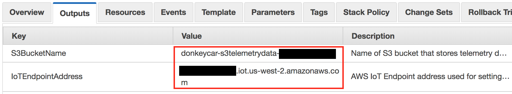
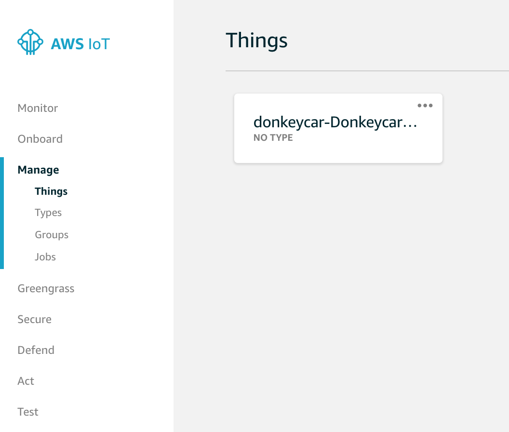
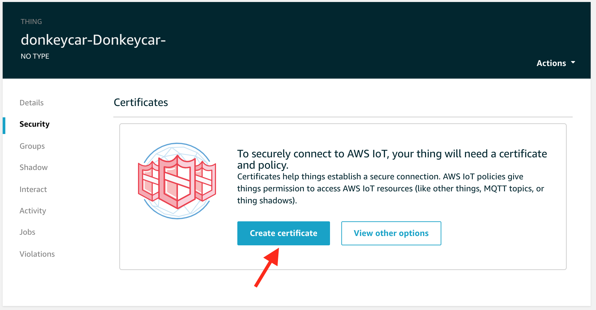
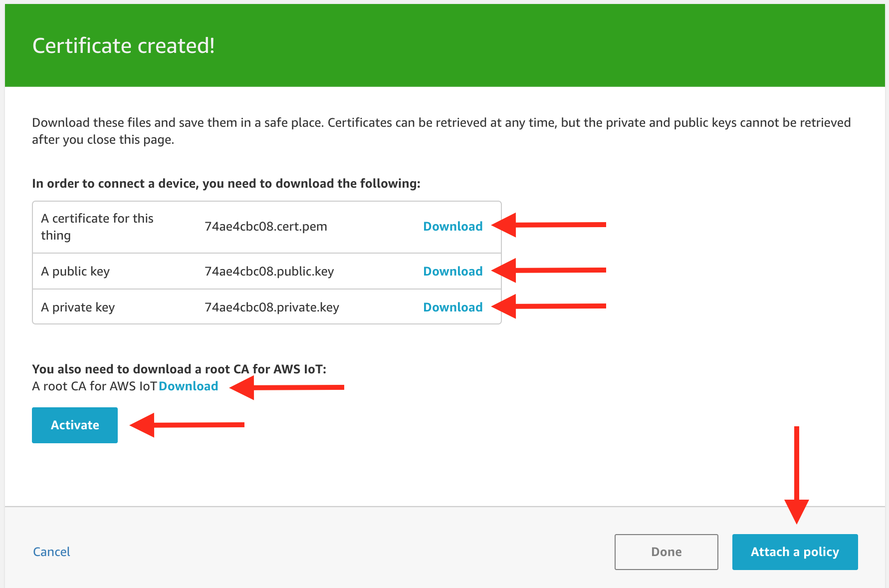
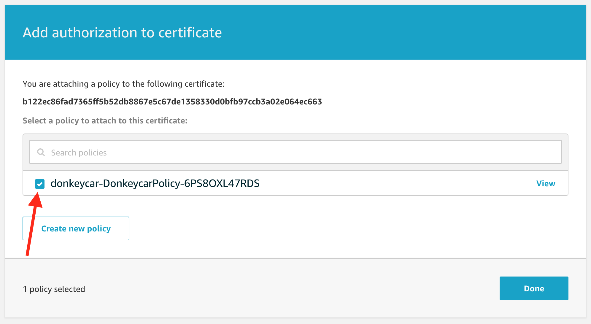
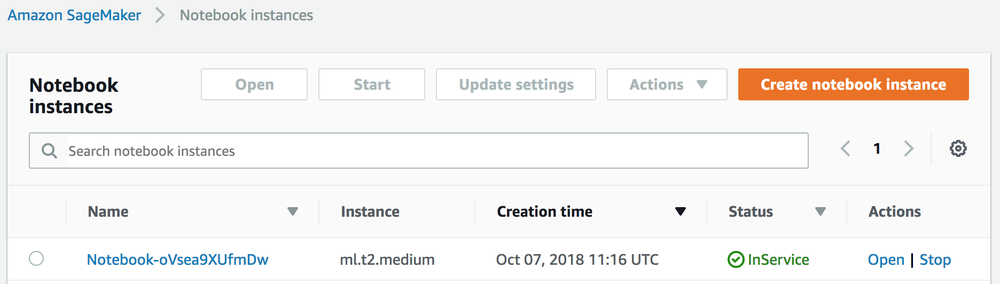
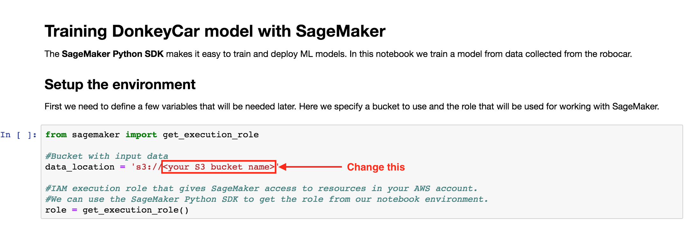
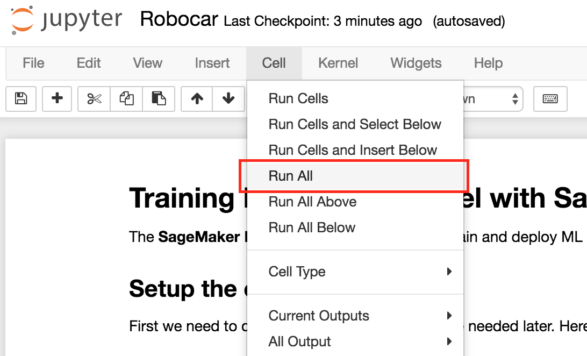
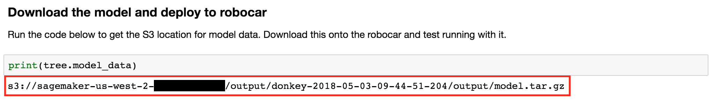

# Donkeycar SageMaker Workshop

This is a self-paced workshop designed for anyone who is interested in building self-driving cars
using Amazon SageMaker.

AWS has published several blog posts that walkthrough the process of building one. In the [first blog
post](https://aws.amazon.com/blogs/ai/build-an-autonomous-vehicle-on-aws-and-race-it-at-the-reinvent-robocar-rally/) 
of the autonomous vehicle series, you built your Donkey vehicle and deployed your pilot server onto
an Amazon EC2 instance. In the [second blog post](https://aws.amazon.com/blogs/ai/build-an-autonomous-vehicle-part-2-driving-your-vehicle/), you
learned to drive the Donkey car, and the Donkey car learned to self-drive. In the [third blog post](https://aws.amazon.com/blogs/ai/building-an-autonomous-vehicle-part-3-connecting-your-autonomous-vehicle/),
you learned about the process of streaming telemetry from the Donkey vehicle into AWS using AWS IoT.
In the [forth blog post](https://aws.amazon.com/blogs/machine-learning/building-an-autonomous-vehicle-part-4-using-behavioral-cloning-with-apache-mxnet-for-your-self-driving-car/),
you learned the concept of behavioral cloning with Convolutional Neural Networks (CNNs).

In this workshop, we will go through how to setup Amazon SageMaker with custom algorithm to train
the model for your autonomous vehicle.

## Prerequisites

You have built a car by following the instructions in [Assemble
hardware](http://docs.donkeycar.com/guide/build_hardware/) and [Install
software](http://docs.donkeycar.com/guide/install_software/) section of the [documentation from
donkeycar](http://docs.donkeycar.com/), with one exception that you use the repo from
https://github.com/chankh/donkey instead.

```
$ git clone https://github.com/chankh/donkey donkeycar 
$ pip install -e donkeycar
```

You will also need to have an AWS account to go through this workshop. 

## Setting up your AWS environment

Previously we would copy the data from the Pi to our Amazon EC2 instance. However with Amazon
SageMaker, you don't need an Amazon EC2 instance. Instead the data will be pulled from Amazon S3. So
let's first create our stack containing all required AWS resources by choosing one of the regions
below.

| Region | Launch Template |
| ------------- | ------------- |
| **N. Virginia** (us-east-1) | [](https://console.aws.amazon.com/cloudformation/home?region=us-east-1#/stacks/new?stackName=donkeycar&templateURL=https://s3.amazonaws.com/khk-us-east-1/sagemaker/donkeycar/donkeycar-workshop.yaml) |
| **Oregon** (us-west-2) | [](https://console.aws.amazon.com/cloudformation/home?region=us-west-2#/stacks/new?stackName=donkeycar&templateURL=https://s3.amazonaws.com/khk-us-east-1/sagemaker/donkeycar/donkeycar-workshop.yaml) |
| **Tokyo** (ap-northeast-1) | [](https://console.aws.amazon.com/cloudformation/home?region=ap-northeast-1#/stacks/new?stackName=donkeycar&templateURL=https://s3.amazonaws.com/khk-us-east-1/sagemaker/donkeycar/donkeycar-workshop.yaml) |

Once the stack is created, status is **CREATE_COMPLETE**, you can find the _AWS IoT Endpoint URL_
and _S3 Bucket Name_ under the **Outputs** tab. Save these values as we will need them later when
configuring our donkeycar and training our model.



## Configuring your Donkeycar

You will need to calibrate your car by following the instructions described in [Calibrate your
car](http://docs.donkeycar.com/guide/calibrate/).

### Connecting your donkeycar to AWS IoT

In your AWS Management Console, go to **Services** then **IoT Core**. In the navigation panel on the
left, click **Manage** and **Things**. You should see a _Thing_ has been created for you.



Click onto the donkeycar item. Next, you will need to create a certificate for our donkeycar to
connect to AWS IoT. To do that, click on **Security** on the navigation panel, and then click
**Create certificate**.



After AWS IoT has created the certificates, you need to download all these certificates into your
donkeycar. Click **Activate** to enable this certificate. Click **Attach a policy** to attach a
policy so that our donkeycar has the right permission to access the platform.



Next, you will be asked to attach a policy to the certificate. The policy is already created for
you. Click the checkbox and then click **Done**.



You have now completed the setup on AWS, next you need to copy the certificates that you have
downloaded to your donkeycar and update the _config.py_ file with the appropriate values.

```
#AWS IOT
IOT_ENABLED = True
VEHICLE_ID = 'donkey'
AWS_ENDPOINT = <replace with endpoint from AWS IoT console>
CA_PATH = <path to the root CA PEM file>
PRIVATE_KEY_PATH = <path to the private key file>
CERTIFICATE_PATH = <path to the certificate file>
```

Save the changes and you are good to go.

## Collecting Data

The first step in teaching your car to drive is laying out a track. After your track is ready,
you’ll need to drive your car through its first round to start training its neural network. Feel
free to use your creativity in the design, but make sure that you incorporate both left and right
hand turns of various degrees to give your neural network exposure to many different situations.
Keep in mind that your car uses its front facing camera to see the track you lay out, so you’ll need
to make sure the tape is easily distinguishable from the floor. 

Make sure you collect good data.

1. Practice driving around the track a couple times without recording data.
2. When you're confident you can drive 10 laps without mistake press Start Recording
3. If you crash or run off the track press Stop Car immediately to stop recording. A little bad data 
won't affect your autopilot.
4. After you've collected 10-20 laps of good data (5-20k images) you can stop your car with Ctrl-c in
the ssh session for your car.
5. The data you've collected is sent to AWS and stored in your Amazon S3 bucket.

## Training the model with Amazon SageMaker

Training the model with Amazon SageMaker

Amazon SageMaker makes it easy to train and deploy ML models. In your AWS Management Console, go to
**Services** and **Amazon SageMaker**. Navigate to **Notebook Instances** on the left, we have
created a notebook for you. Click **Open** to launch your notebook.



Download the [notebook from here](notebook/donkeycar.ipynb) and upload to your notebook environment
in Amazon SageMaker. After that click on the name _donkeycar.ipynb_ to open this notebook.

In the notebook, you need to update the value of **data_location** to the name of your S3 bucket,
which you can retrieve from the Outputs in CloudFormation.



After that, you can run the notebook by clicking **Cell** and **Run all**.



## Download the model and deploy to robocar

Amazon SageMaker saves the model to a S3 location. You can now download the model from S3 into your
donkeycar and extract the contents from the tarball. This should give you a file named donkeycar.



```
$ curl -O <S3 location>
$ tar -zxf model.tar.gz
```

Run your autonomous vehicle using the downloaded model.

```
$ python manage.py drive --model donkeycar
```

Conclusion

Amazon SageMaker provides an easy to use platform for building ML models. In this post, you've seen
how it's possible to bring your own algorithms to SageMaker and start training immediately. It is so
easy that even someone without knowledge on ML is able to do it without any special training.

